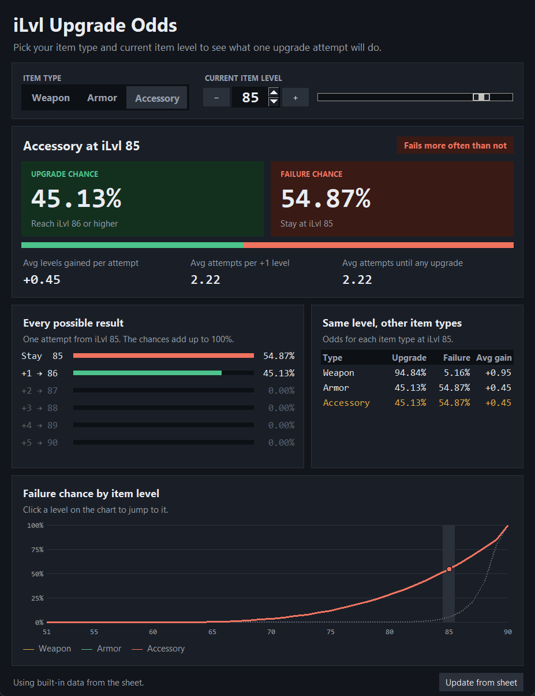

# iLvl Upgrade Odds

A desktop app built with Python and Tkinter that shows your chances of upgrading an item's level. Pick an item type and your current item level to see the **upgrade chance** and **failure chance** for one upgrade attempt.

---

## Features

* **Upgrade chance:** the chance to reach at least one item level higher (iLvl + 1 or more) from a single attempt.
* **Failure chance:** the chance the attempt fails and the item stays at its current iLvl. An attempt never lowers your item level.
* **Every possible result:** the odds of each outcome, from staying at the same level to jumping up to +5 levels.
* **Averages:** levels gained per attempt, attempts per +1 iLvl, and attempts until you get any upgrade.
* **Item type comparison:** Weapon, Armor and Accessory odds side by side at your current iLvl.
* **Failure curve chart:** failure chance across iLvl 51–90 for every item type. Click the chart to jump to a level.
* **Update from sheet:** pulls the latest odds from the source Google Sheet. The app has a built-in copy of the data, so it also works offline.



---

## Download and run

Download `iLvl Upgrade Odds.exe` from the [Releases](../../releases) page and double-click it. You don't need to install Python.

## Run from source

Requires Python 3.10+ with Tkinter, which is included in the standard Windows installer.

```bash
python ilvl_odds.py
```

## Build the .exe

```bash
pip install pyinstaller
python -m PyInstaller --onefile --windowed --name "iLvl Upgrade Odds" ilvl_odds.py
```

The executable is written to `dist/`.

---

## Data

The odds come from the Data tabs of the [upgrade odds spreadsheet](https://docs.google.com/spreadsheets/d/1vwajieBpz1aG5w9Bowha_bi0FKsclHv6GOT3r0qvzps/edit). Each row gives the probability (in basis points, 10000 = 100%) of moving from a current level to a target level, for jumps from +0 to +5.

| Item type | Source tab |
|---|---|
| Weapon | Weapons Data |
| Armor | Accessory Data |
| Accessory | Accessory Data |

Armor uses the **Accessory Data** tab because armor and accessories share the same upgrade odds. The sheet's Armor Data tab holds different numbers and is not used.

How the values are calculated:

* Failure chance = P(+0)
* Upgrade chance = 1 − P(+0)
* Avg levels gained per attempt = Σ jump × P(jump)
* Avg attempts per +1 iLvl = 1 ÷ avg levels gained per attempt
* Avg attempts until any upgrade = 1 ÷ upgrade chance

Item level 90 is the cap, so an attempt at iLvl 90 always stays at 90.
